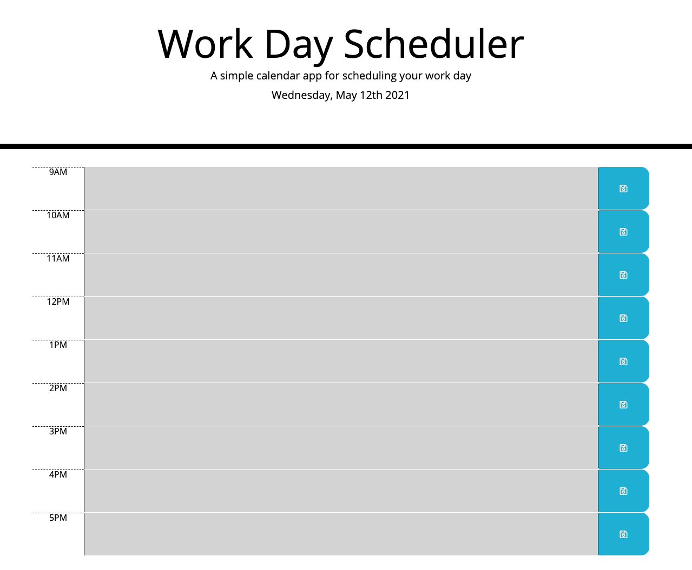

# Work Day Scheduler Starter Code

## Description 

Create a daily planner to manage time effectively.

Acceptance Criteria
* Daily planner to create a schedule
* Current day displayed
* time blocks for standard business hours
* time block are color-coded to show past, present, or future
* enter events and save content for specific time block
* data is saved in local storage

## Screenshot 

Screenshot of final web page

## live

Live URL of site

https://kalesaladboi.github.io/disco-task-master/

## Repository

https://github.com/kalesaladboi/disco-task-master

